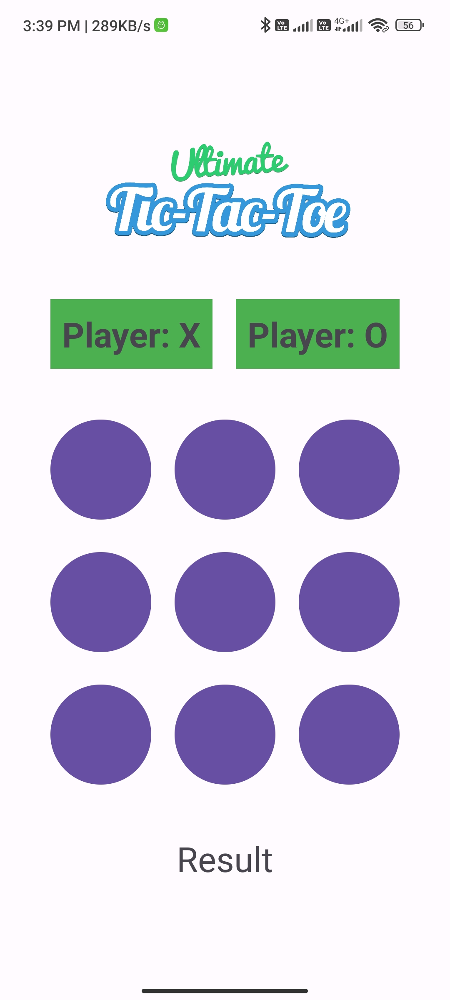
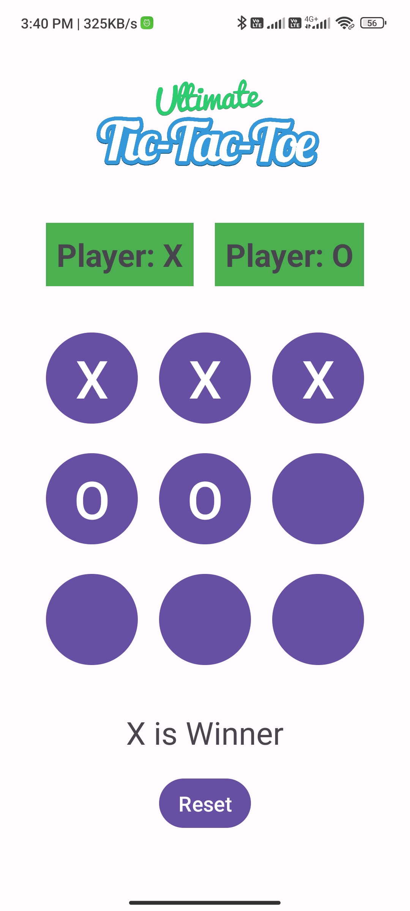
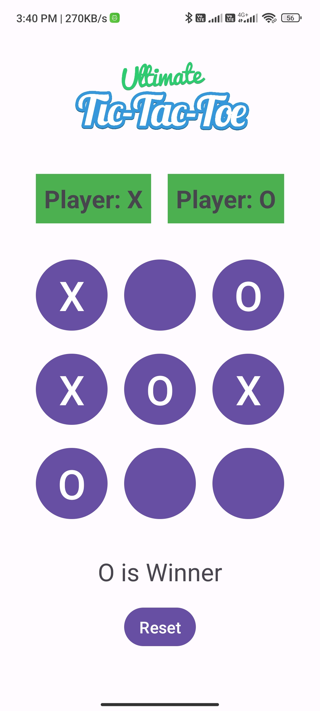

# TicTacToe-Android-Game
This is a simple Tic Tac Toe game implemented for Android devices. The game allows two players to take turns and play the classic Tic Tac Toe game.
## Features
- Two-player gameplay
- Interactive game board
- Win condition detection
- Restart option
## Screenshots

## Getting Started
These instructions will help you set up and run the project on your local machine.
### Prerequisites
- Android Studio: Download and install [Android Studio](https://developer.android.com/studio) if you haven't already.
- Android Device/Emulator: You will need an Android device or emulator to run the game.
### Installation
1. Clone the repository:

git clone https://github.com/sydtanvirali/TicTacToe-Android-Game.git

2. Open the project in Android Studio.
3. Build and run the app on your device or emulator.
## How to Play
1. Launch the app and you'll be taken to the game board.
2. Player 1 starts the game by tapping an empty cell on the board.
3. Alternating turns, the players continue selecting empty cells.
4. The first player to get 3 in a row (horizontally, vertically, or diagonally) wins.
5. If all cells are filled and no player has won, the game is a draw(Ties).
## Contributing
Contributions are welcome! If you find any issues or want to add enhancements to the game, feel free to open a pull request.
